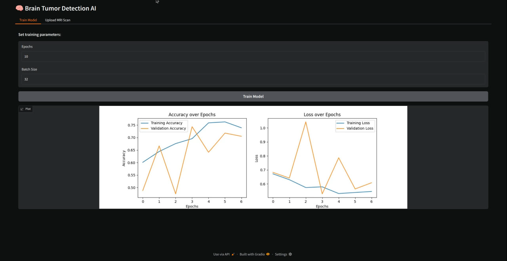
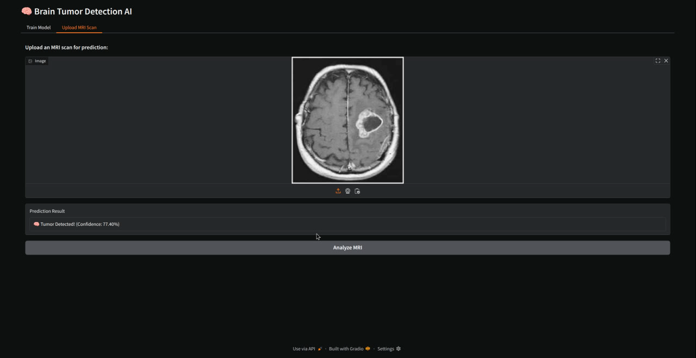

# Brain Tumor Detector

## Description
This project is a brain tumor detection model that uses machine learning techniques to classify images as either containing a tumor or not.

## Installation
1. Clone the repository:
   ```bash
   git clone https://github.com/infangle/brain-tumor-detector.git
   ```
2. Navigate to the project directory:
   ```bash
   cd brain-tumor-detector
   ```
3. Install the required dependencies (if any).

## Usage
Run the model using the following command:
```bash
python brain_tumor_model.py
```

## License
This project is licensed under the MIT License.

## Screenshots

### Training Parameters


### MRI Upload

